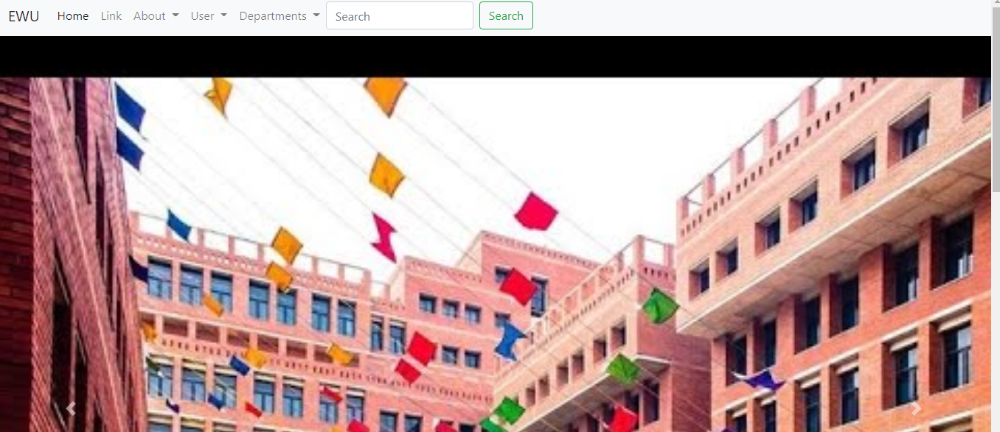
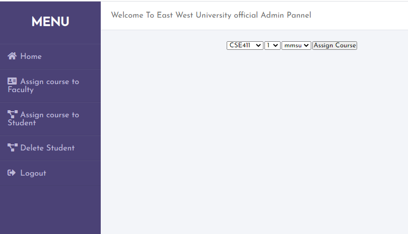
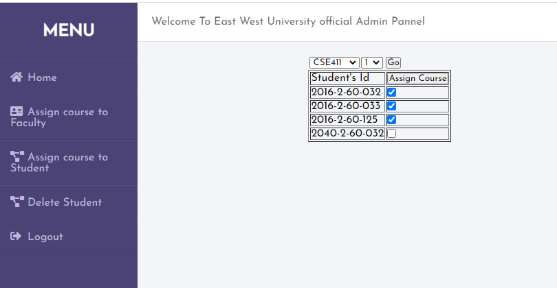
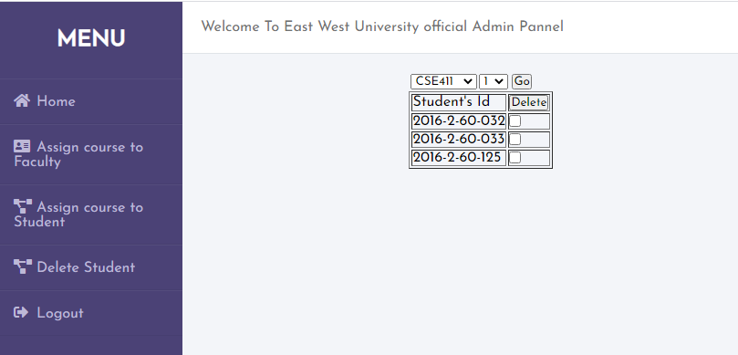
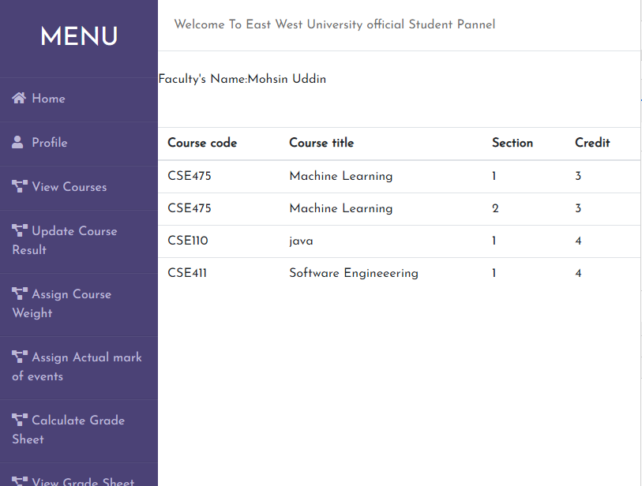
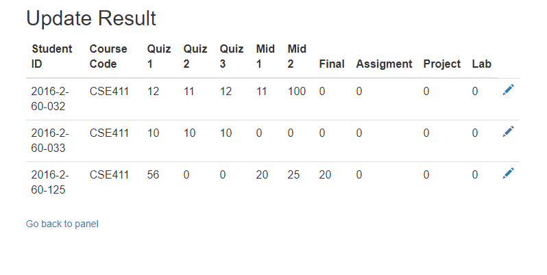
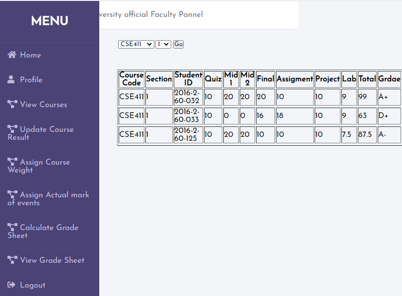
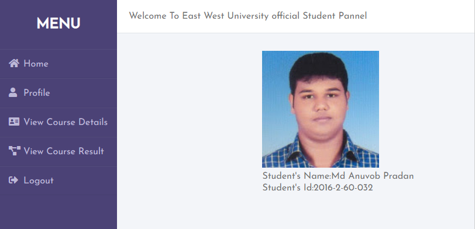
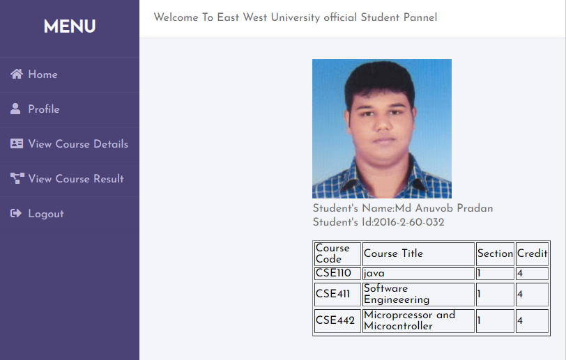
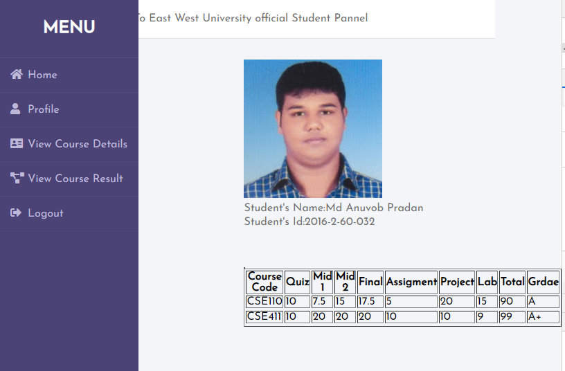

# Online-Result-Management-System
This is a management system where teachers can manage the result and grading information of a course. In addition, this system also contains several useful functionalities for admin and student users also.

Programming language: PHP, JavaScript.

Database: MySQL.

For web page design: HTML, CSS, and Bootstrap.

## Snapshot 1:(Home Page)

## Snapshot 2:(Assign course to faculty)

## Snapshot 3:(Assign course to student)

## Snapshot 4:(Delete student from a course)

## Snapshot 5:(Course list of faculty)

## Snapshot 6:(Student's marks update page)

## Snapshot 7:(Students grade list)

## Snapshot 8:(Student's Profile)

## Snapshot 9:(Student's course list)

## Snapshot 10:(Student's course grade)

